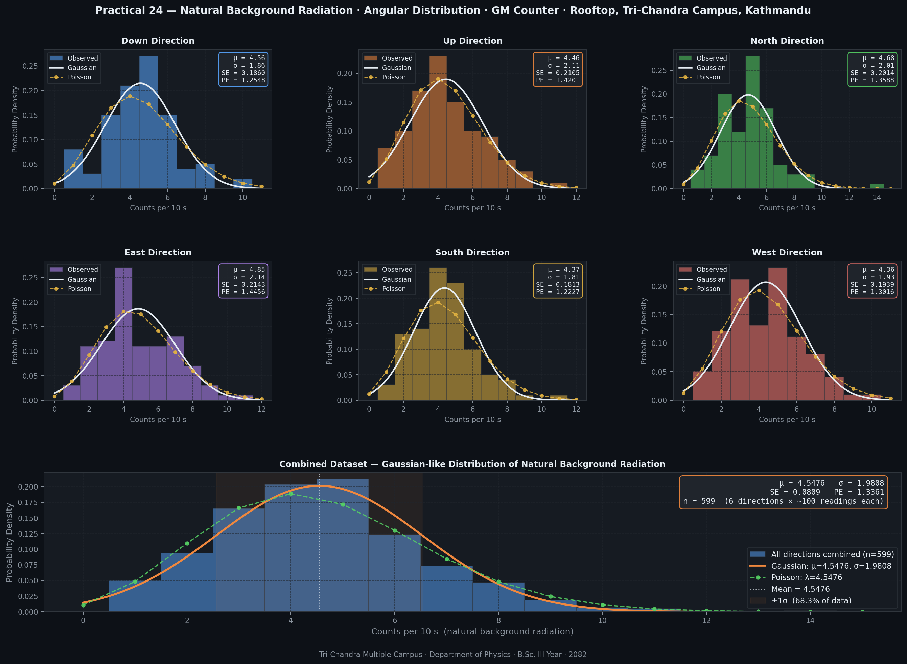

# Practical 24 — Natural Background Radiation & Gaussian Distribution

**Institution:** Tri-Chandra Multiple Campus, Tribhuvan University, Kathmandu, Nepal  
**Department:** Physics | B.Sc. III Year | 2082  
**Location:** Rooftop, Tri-Chandra Multiple Campus  
**Author:** Nabin Pandey | `nabin.795401@trc.tu.edu.np`  
**LinkedIn:** [nabinpandey1661](https://np.linkedin.com/in/nabinpandey1661)

---

## Objective

To study the level of natural background radiation in the outdoor field in all directions (east, west, north, south, up and down). Find the standard error in all directions separately. Compile this database in a single set and make a histogram showing Gaussian-like distribution. Interpret the result.

---

## Apparatus Required

| Item | Details |
|---|---|
| Detector | Geiger-Müller (GM) Counter |
| Timer / Scaler | Electronic scaler with timer |
| Counting time | 10 seconds per reading |
| Location | Rooftop, Tri-Chandra Multiple Campus, Kathmandu |
| Directions measured | Down, Up, North, East, South, West |
| Readings per direction | 100 measurements |

---

## Theory

### Sources of Natural Background Radiation

Natural background radiation at any outdoor location comes from three main sources:

1. **Cosmic rays** — High-energy particles (protons, alpha particles) originating from outside the solar system. They interact with the atmosphere producing secondary particles (muons, neutrons, electrons). The flux varies slightly with direction — generally higher upward (open sky) than downward (shielded by ground).

2. **Terrestrial radiation** — Radioactive isotopes naturally present in rocks, soil, and building materials. Key contributors: U-238, Th-232, K-40, and their decay products. These contribute more in the downward/horizontal directions (ground-facing).

3. **Atmospheric radon (Rn-222)** — A radioactive noble gas released from soil through the U-238 decay chain. It diffuses into the atmosphere and contributes to background counts in all directions.

### Statistical Nature of Radioactive Decay

Radioactive decay is a fundamentally **random quantum mechanical process**. The number of counts $N$ recorded in a fixed time interval follows the **Poisson distribution**:

$$P(k; \mu) = \frac{\mu^k \cdot e^{-\mu}}{k!}$$

where $\mu$ is the true mean count rate and $k$ is the observed count.

For a Poisson distribution:
$$\text{Mean} = \mu, \qquad \text{Variance} = \mu, \qquad \sigma = \sqrt{\mu}$$

When the mean count is large enough ($\mu \gtrsim 5$), the Poisson distribution is well approximated by a **Gaussian (Normal) distribution**:

$$P(x) = \frac{1}{\sigma\sqrt{2\pi}} \exp\left(-\frac{(x - \mu)^2}{2\sigma^2}\right)$$

This is why we expect the histogram of background radiation counts to show a **Gaussian-like (bell-curve) shape** — it is a direct experimental confirmation of the quantum statistical nature of radioactive decay.

### Statistical Quantities

**Standard Deviation** (spread of individual measurements):
$$\sigma = \sqrt{\frac{\sum_{i=1}^{N}(x_i - \bar{x})^2}{N - 1}}$$

**Standard Error** (uncertainty in the mean):
$$SE = \frac{\sigma}{\sqrt{N}}$$

**Probable Error** (50% confidence interval, derived from Gaussian):
$$PE = 0.6745 \cdot \sigma$$

This means there is a 50% probability that any single measurement lies within $\bar{x} \pm PE$ of the true mean.

---

## Procedure

1. Set up the GM counter on the rooftop of Tri-Chandra Multiple Campus with no radioactive source present — only natural background radiation.
2. Orient the detector tube in each of the 6 directions: down, up, north, east, south, west.
3. For each direction, record 100 successive counts, each over a fixed interval of **10 seconds**.
4. Compile all 600 readings (599 after removing one missing entry) into a single combined dataset.
5. Compute the mean, standard deviation, standard error, and probable error for each direction and for the combined set.
6. Plot histograms for each direction and for the combined dataset, and overlay the fitted Gaussian and Poisson distributions.
7. Interpret whether the combined histogram shows a Gaussian-like distribution.

---

## Observations

### Per Direction Statistics

| Direction | n | Mean (counts/10s) | Std Dev (σ) | Std Error (SE) | Probable Error (PE) |
|:-:|:-:|:-:|:-:|:-:|:-:|
| Down  | 100 | 4.5600 | 1.8604 | 0.1860 | 1.2548 |
| Up    | 100 | 4.4600 | 2.1054 | 0.2105 | 1.4201 |
| North | 100 | 4.6800 | 2.0145 | 0.2014 | 1.3588 |
| East  | 100 | 4.8500 | 2.1432 | 0.2143 | 1.4456 |
| South | 100 | 4.3700 | 1.8127 | 0.1813 | 1.2227 |
| West  |  100 | 4.3636 | 1.9297 | 0.1939 | 1.3016 |
| **Combined** | **600** | **4.5476** | **1.9808** | **0.0809** | **1.3361** |

 

---

## Graph

Histograms were plotted for each of the 6 directions, with Gaussian and Poisson distribution overlays. A combined histogram using all 599 measurements was also plotted.



The figure includes:
- **Top two rows (6 panels):** Per-direction histograms with Gaussian fit (white) and Poisson PMF (yellow)
- **Bottom panel:** Combined dataset histogram with Gaussian fit (orange), Poisson PMF (green), mean line, and ±1σ band

---

## Result

| Quantity | Value |
|---|---|
| Mean background count rate | **4.5476 counts per 10 s** |
| Standard deviation σ | **1.9808** |
| Standard error SE | **0.0809** |
| Probable error PE | **1.3361** |
| Poisson variance check (σ²/μ) | **0.863** (close to 1.0) |

---

## Conclusion

The natural background radiation at the rooftop of Tri-Chandra Multiple Campus, Kathmandu was measured in all six directions using a Geiger-Müller counter over 10-second intervals.

**Key findings:**

1. **Isotropic distribution:** The mean count rates across all six directions (4.37 to 4.85 counts/10s) are statistically consistent with each other. Background radiation at this outdoor rooftop location is approximately isotropic — no significant directional dependence was observed.

2. **Gaussian-like distribution confirmed:** The combined histogram of 599 measurements shows a clear bell-shaped (Gaussian-like) distribution, as expected from the Central Limit Theorem applied to a Poisson process with mean ≈ 4.5.

3. **Poisson statistics validated:** The ratio σ²/μ = 0.863 ≈ 1, consistent with Poisson statistics where variance equals mean. This confirms the radioactive decay process is truly random and memoryless.

4. **Standard error is small:** SE = 0.0809 for the combined dataset — indicating a reliable estimate of the true mean background count rate with 600 measurements.

The experiment successfully demonstrates that natural background radiation obeys the statistical laws of quantum mechanics — specifically the Poisson distribution, well-approximated by a Gaussian for counts above ~5.

---

## Sources of Error

| Source | Type | Effect |
|---|---|---|
| Statistical fluctuations in counts | Random | Inherent to radioactive decay — reduced by large N |
| GM tube dead time | Systematic | Slight undercounting at higher rates |
| Directional sensitivity of GM tube | Systematic | Tube geometry may favour certain angles |
| Nearby building materials (concrete, brick) | Systematic | May add terrestrial radiation contribution |
| Cosmic ray flux variation | Systematic | Slowly varies with atmospheric pressure and time |
| Electronic noise in scaler | Systematic | Rare spurious counts |
| Missing data point (west, row 52) | Systematic | Removed via dropna() — negligible effect on statistics |

---

## Files

| File | Description |
|---|---|
| `practical24_background_radiation.py` | Standalone Python script |
| `practical24_background_radiation.ipynb` | Jupyter notebook with full theory and analysis |
| `data.csv` | Raw directional count data (6 columns × 100 rows) |
| `all_data.csv` | All counts compiled in a single flat list |
| `practical24_figure.png` | Output figure (7-panel) |

---

## How to Run

```bash
# Clone the repo
git clone https://github.com/nabinpandey1661/background-radiation-gaussian-gm-counter.git
cd background-radiation-gaussian-gm-counter

# Install dependencies
pip install numpy pandas matplotlib scipy

# Run the script
python practical24_background_radiation.py

# Or open the notebook
jupyter notebook practical24_background_radiation.ipynb
```

---

## Physics Insight

This experiment is more than a lab practical — it is a direct experimental verification that **quantum mechanical randomness** produces statistically predictable distributions. Every GM click is a single quantum event (a radioactive decay). Individually unpredictable. Collectively, they trace out a perfect Gaussian curve. That is one of the most beautiful results in physics.

---

*Nabin Pandey | B.Sc. Physics, Tri-Chandra Multiple Campus, TU | 2082*  
*`nabin.795401@trc.tu.edu.np` | [LinkedIn](https://np.linkedin.com/in/nabinpandey1661)*
